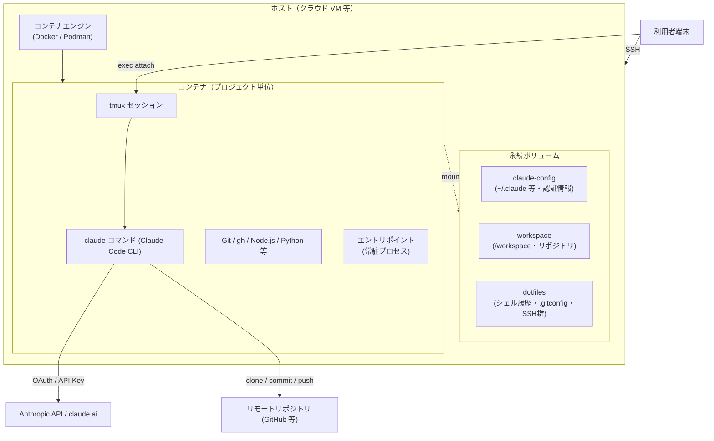
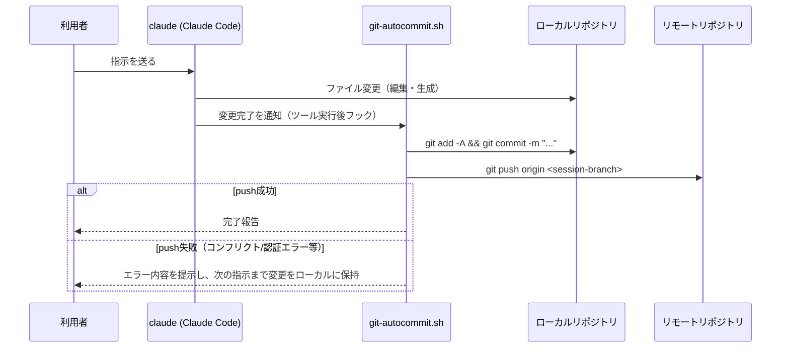

# claude-code-container 設計書

本書は [要件定義書](requirements.md) で定義した要件を実現するための技術設計をまとめたものである。
利用者向けの操作手順は [取り扱い説明書](manual.md)、利用シーンは [ユースケース定義書](use-cases.md)
を参照すること。各章末に対応する要件番号を付記する。

## 1. 全体アーキテクチャ



- 1コンテナ＝1プロジェクトを原則とし、同一ホスト上で複数コンテナを並行稼働できる（3.1, 4.4）。
- コンテナはフォアグラウンドプロセス（エントリポイント）により常駐し、`restart: unless-stopped`
  相当のポリシーで再起動に耐える（4.4, 5.2）。
- 認証情報・作業データはホスト側ボリュームに永続化し、コンテナのライフサイクルから切り離す（4.5）。

対応要件: 3.1, 4.3, 4.4, 4.7, 4.11

## 2. ディレクトリ構成

```
claude-code-container/
├── Dockerfile                  # Claude Code CLI + 開発ツールを含むイメージ定義
├── docker-compose.yml          # 常駐起動・ボリュームマウント定義（Docker既定値）
├── docker-compose.podman.yml   # Podman固有の差分（SELinuxラベル等）を上書きする override
├── .env.example                # コンテナエンジン選択・プロジェクト名等の環境変数サンプル
├── scripts/
│   ├── check-env.sh            # セットアップ前環境チェック
│   ├── up.sh                    # 起動スクリプト（CONTAINER_ENGINE に応じてcompose起動コマンド・overrideファイルを選択）
│   ├── entrypoint.sh            # コンテナ常駐用エントリポイント（初回clone・権限調整）
│   ├── session-branch.sh        # 対話セッション開始検知→ブランチ作成
│   └── git-autocommit.sh        # 変更検知→commit/push 自動化
├── docs/
│   ├── requirements.md
│   ├── use-cases.md
│   ├── design.md               # 本書
│   └── manual.md
└── README.md
```

対応要件: 6章（構成イメージ）

## 3. コンテナイメージ設計（Dockerfile）

| 項目 | 内容 |
| --- | --- |
| ベースイメージ | `debian:bookworm-slim` または `ubuntu:22.04` などの LTS 系 |
| ランタイム | Node.js 18 系（LTS）を `nodesource` 等から導入し、Claude Code CLI の動作要件を満たす |
| Claude Code CLI | `npm install -g @anthropic-ai/claude-code` 相当。`ARG CLAUDE_CODE_VERSION` でビルド時に固定バージョン／最新版を選択可能にする |
| 同梱ツール | `git`, `gh`（GitHub CLI）, `python3`/`pip`, `tmux`, `curl`, `ca-certificates` |
| 実行ユーザー | 非rootの一般ユーザー（例: `dev`, UID/GID をホストと合わせられるよう `ARG` で調整可） |
| 作業ディレクトリ | `/workspace` |
| ENTRYPOINT | `scripts/entrypoint.sh`（コンテナに `COPY` して実行権限を付与） |

対応要件: 4.1, 4.2, 4.6, 5.1

### 3.1 ビルド時パラメータ（ARG / 環境変数）

| 変数 | 用途 | 既定値 |
| --- | --- | --- |
| `CLAUDE_CODE_VERSION` | インストールする CLI バージョン | `latest` |
| `CONTAINER_UID` / `CONTAINER_GID` | 非root実行ユーザーの UID/GID（ホストとのファイル所有者整合） | `1000` |
| `ANTHROPIC_API_KEY` | API キー認証を使う場合に設定（未設定時は OAuth ログインを想定） | 未設定 |

## 4. compose 設計（docker-compose.yml）

```yaml
services:
  claude-code:
    build:
      context: .
      args:
        CONTAINER_UID: ${CONTAINER_UID:-1000}
        CONTAINER_GID: ${CONTAINER_GID:-1000}
    restart: unless-stopped
    tty: true
    stdin_open: true
    environment:
      - ANTHROPIC_API_KEY=${ANTHROPIC_API_KEY:-}
      - GIT_REPO_URL=${GIT_REPO_URL}
      - GIT_BASE_BRANCH=${GIT_BASE_BRANCH:-main}
      - CLAUDE_AUTO_APPROVE=${CLAUDE_AUTO_APPROVE:-true}
    volumes:
      - claude-config:/home/dev/.claude
      - workspace:/workspace
      - dotfiles:/home/dev/.dotfiles
    command: ["scripts/entrypoint.sh"]

volumes:
  claude-config:
  workspace:
  dotfiles:
```

- Podman 利用時は `docker-compose.podman.yml` を `-f docker-compose.yml -f docker-compose.podman.yml`
  で重ねて適用し、ボリュームマウントに `:Z` ラベルを付与する等の差分のみを吸収する。この重ね合わせは
  利用者が手打ちで指定するのではなく、`scripts/up.sh`（5章）が `CONTAINER_ENGINE` の値を見て
  自動的に付与する。取り扱い説明書のコマンド例も `scripts/up.sh` 経由に統一し、override 忘れを防ぐ。
- プロジェクトを複数並行稼働させる場合は `-p <project-name>` を指定し、ボリューム名の衝突を防ぐ
  （5章参照）。`scripts/up.sh` は第一引数にプロジェクト名を受け取り、`-p` へ渡す。

対応要件: 4.4, 4.5, 4.8

## 5. 起動スクリプト設計（scripts/up.sh）

コンテナエンジンの選択（4.8）を実際にコマンドへ反映する起動スクリプト。利用者は Docker /
Podman のいずれの場合も本スクリプト経由での起動を基本とする（取り扱い説明書 3.4・6章も本スクリプト
呼び出しに統一する）。

### 5.1 処理内容

```
1. .env（または環境変数）から CONTAINER_ENGINE（既定 docker）を読み取る。
2. CONTAINER_ENGINE=docker の場合:
     docker compose [-p <project>] up -d
3. CONTAINER_ENGINE=podman の場合:
     podman compose（無ければ podman-compose）[-p <project>] \
       -f docker-compose.yml -f docker-compose.podman.yml up -d
   （override ファイルの重ね合わせは本スクリプトが必ず行い、利用者が個別に指定する必要はない）
4. compose / podman-compose コマンド自体が見つからない場合は、check-env.sh を未実施であることを
   案内して終了する。
5. 第一引数が与えられた場合、プロジェクト名として `-p` に渡す（5章の複数プロジェクト運用に対応）。
```

- 事前に `scripts/check-env.sh` を呼び出し、必須項目が NG の場合は起動処理へ進まない
  （4.9 のセットアップフロー統合要件に対応）。

対応要件: 4.8, 4.9

## 6. 環境チェック設計（scripts/check-env.sh）

### 6.1 チェック項目と判定ロジック

| # | 項目 | 区分 | 判定方法 | NG時の出力例・挙動 |
| --- | --- | --- | --- | --- |
| 1 | コンテナエンジンの有無・バージョン | 必須 | `docker --version` / `podman --version` の実行可否とバージョン比較 | インストール手順 URL を提示し中断 |
| 2 | compose ツールの有無 | 必須 | `docker compose version` / `podman-compose --version` の実行可否 | 導入コマンド例を提示し中断 |
| 3 | 必須コマンド | 必須 | `command -v git` 等の存在確認 | パッケージマネージャ別インストールコマンドを提示し中断 |
| 4 | ディスク空き容量 | 必須 | `df` で作業ディレクトリのマウント先空き容量を取得し閾値と比較 | 必要空き容量と現状値を提示し中断 |
| 5 | メモリ | 任意（警告） | `/proc/meminfo` 等から総メモリ量を取得し閾値と比較 | 推奨メモリ量と現状値を警告表示するが、セットアップは続行可能 |
| 6 | ネットワーク到達性 | 必須 | `curl -sSf https://api.anthropic.com` 等への到達確認 | プロキシ設定・ファイアウォール確認を促し中断 |

- 「必須」項目が1つでも NG の場合はセットアップを中断する（4.9 の「必須項目にNGがある場合は
  中断」に対応）。「任意（警告）」項目は NG でも処理を継続するが、警告として結果に残す。
- メモリのみ「任意」とするのは、必要メモリ量がホスト構成やプロジェクト規模に依存し一律の
  閾値で中断させるのが適切でないためである。将来的に必須へ変更する場合は本表を更新する。

### 6.2 出力フォーマット

```
[OK] Docker: 24.0.7 (>= 20.10 required)
[OK] docker compose: v2.21.0
[OK] git: 2.39.2
[NG] disk free space: 3.2GB (>= 10GB required)
      -> 対処: 不要なイメージ・ボリュームを削除するか、ディスクを拡張してください。
セットアップを中断しました。上記 NG 項目を解消後、再実行してください。
```

- 終了コード: 全項目 OK の場合 `0`、いずれかが必須項目で NG の場合 `1`（呼び出し元の
  セットアップスクリプトはこれを見て処理を中断する）。
- セットアップスクリプト（`docker compose up -d` 等を呼ぶラッパー、または README 記載手順）から
  事前呼び出しされる想定とし、単体実行も可能にする。

対応要件: 4.9

## 7. エントリポイント設計（scripts/entrypoint.sh）

コンテナ起動時（初回のみ実行される処理と、毎回実行される処理を分離する）。

```
1. 毎回: ボリュームの所有者・パーミッションを非rootユーザーに合わせて調整（chown/chmod）
2. 毎回: dotfiles ボリューム（/home/dev/.dotfiles）配下の bash_history / gitconfig / ssh が
   未リンクであれば、~/.bash_history・~/.gitconfig・~/.ssh へのシンボリックリンクを作成する
   （既にリンク済みの場合はスキップし、8章のボリューム設計を実体化する）
3. 初回のみ判定: /workspace 配下にリポジトリが未 clone であれば
   git clone "$GIT_REPO_URL" /workspace/<repo>
   （2回目以降の起動では clone をスキップし、既存の作業内容をそのまま利用する）
4. tmux サーバーをバックグラウンドで起動（セッションが無ければ作成）
5. フォアグラウンドプロセスとして待受状態を維持（例: `tail -f /dev/null` あるいは
   `tmux -CC` の待受）し、コンテナを常駐させる
```

- 「対象リポジトリを一度だけ clone し、以降は切り替えない」という要件（4.11）を、
  `/workspace/.repo-initialized` のようなマーカーファイルの有無で判定する。
- 認証情報ディレクトリが空（初回起動）の場合は、`claude login` の実行を促すメッセージを
  標準出力に表示する。

対応要件: 4.3, 4.4, 4.11

## 8. データ永続化設計（ボリューム一覧）

| ボリューム | マウント先（コンテナ内） | 内容 | 消失時の影響 |
| --- | --- | --- | --- |
| `claude-config` | `/home/dev/.claude` | OAuth トークン、CLI 設定 | 再ログインが必要になる |
| `workspace` | `/workspace` | clone 済みリポジトリ、作業ファイル | 未pushの変更が失われる |
| `dotfiles` | `/home/dev/.dotfiles`（`~/.bash_history`, `~/.gitconfig`, `~/.ssh` をシンボリックリンク） | シェル履歴、Git設定、SSH鍵 | 認証設定・履歴が失われる |

- ボリューム名はプロジェクト（compose の `-p` オプション）ごとに分離され、他プロジェクトと
  干渉しない（4.4, 4.5）。
- 認証情報・SSH鍵を含むボリュームはホスト側でパーミッション 600 相当に設定する運用を前提とする
  （5.1）。

対応要件: 4.5, 5.1

## 9. コンテナエンジン差異吸収設計（Docker / Podman）

| 差異点 | Docker | Podman（rootless） | 吸収方法 |
| --- | --- | --- | --- |
| ボリュームの SELinux ラベル | 不要 | `:Z`（専有）/`:z`（共有）が必要な場合あり | `docker-compose.podman.yml` の override でラベル付きマウントを定義 |
| compose 実行コマンド | `docker compose` | `podman-compose` または `podman compose` | `scripts/up.sh`（5章）がコマンドの存在確認をして自動選択 |
| デーモンの有無 | dockerd（root権限が必要な場合あり） | デーモンレス・rootless | Podman選択時は `sudo` 不要な手順のみを案内 |
| ネットワークモード | bridge がデフォルト | slirp4netns 等 | 明示的なポート公開が必要な場合のみ compose 側で調整 |

コンテナエンジンの選択は環境変数 `CONTAINER_ENGINE=docker|podman`（未指定時 `docker`）で行い、
`scripts/up.sh`（5章）がこの値を見て使用する compose コマンド・override ファイルを切り替える。

対応要件: 4.8, 5.1, 5.4

## 10. 自動承認モード設計

- `claude` コマンドの起動時オプション（`--dangerously-skip-permissions` 相当）をデフォルトの
  起動コマンドに含める形で提供する（`.env` の `CLAUDE_AUTO_APPROVE=true` 等で on/off 切り替え）。
- 逐一確認したい利用者向けに、オプションを外した対話モードでの起動コマンドも README・
  取り扱い説明書に明記する。
- 破壊的操作（force push 等）は自動承認の対象から除外し、明示的な指示・確認を要する運用とする
  （実装上は Claude Code 自体の安全策に委ねる）。

対応要件: 4.10, 5.1

## 11. Git ワークフロー自動化設計

### 11.1 セッション開始の検知

対話セッション（Claude Code との1回の会話単位）の開始を検知する方式として、以下を採用する。

- Claude Code CLI が提供するセッション開始フック／イベント（利用可能な場合）を優先して使用する。
- CLI 側にフックがない場合のフォールバックとして、`scripts/session-branch.sh` を
  `claude` の起動ラッパーとして経由させ、ラッパー起動のたびに「新規対話セッション開始」と
  みなす。

### 11.2 ブランチ命名規則

```
session/<YYYYMMDD-HHMMSS>-<セッションID or ランダム短縮ID>
```

- ベースブランチ（既定 `main`、`.env` の `GIT_BASE_BRANCH` で変更可）から作成する。
- 利用者が明示的にブランチ名を指定したい場合は、起動時引数で上書きできるようにする。

### 11.3 commit / push 自動化



- commit 粒度は「1指示（1ラウンドのやり取り）につき1コミット」を既定とする（要件定義書
  8章の未決事項に対する設計判断）。将来的に変更単位のスカッシュ等を選択できるよう、
  コミットメッセージにセッションID・指示要約を含める。
- push 失敗時（コンフリクト・認証エラー・ネットワーク断）は自動リトライを行わず、
  エラー内容を利用者に提示したうえで、次の指示が来るまでローカルコミットとして保持する
  （自動での force push は行わない）。
- Pull Request の自動作成は本フェーズのスコープ外とし、push までを自動化範囲とする
  （要件定義書 8章の未決事項に対する設計判断。将来的に `gh pr create` 連携を追加できる
  構成にしておく）。

対応要件: 4.11, 5.1

## 12. セキュリティ設計

- コンテナ内プロセスは非rootユーザー（`dev` 等）で実行し、`sudo` は付与しないか、
  パッケージ追加等に必要な最小限のコマンドのみに制限する。
- 認証情報を含むボリューム（`claude-config`, `dotfiles` 内のSSH鍵）は、ホスト側で
  パーミッション 600 / ディレクトリ 700 を徹底する。運用手順は取り扱い説明書に明記する。
- 自動承認モードは非root実行・作業ブランチの分離（11章）と組み合わせて運用し、
  破壊的操作（force push、`main` への直接push等）はデフォルトで無効化する。
- 個人利用を主目的とするため、コマンド実行やネットワークアクセスへの厳格なサンドボックス化は
  必須としない（要件定義書 5.1 に準拠）。

対応要件: 5.1

## 13. ログ・運用設計

- コンテナの標準出力ログは `docker compose logs -f` / `podman-compose logs -f` で確認できる
  構成とする。
- エントリポイント・自動commit/pushスクリプトは、処理内容（clone実行有無、commit hash、
  push成否）を標準出力へ出力し、ログとして残す。
- ホスト・コンテナの再起動後は `scripts/up.sh`（5章）を再実行するのみで復旧できる
  （8章のボリューム設計により状態が保持されるため、追加の復旧手順を要しない）。

対応要件: 5.2, 5.3

## 14. 要件定義書「今後の検討事項」への対応方針（本設計での暫定決定）

| 検討事項 | 本設計での方針 |
| --- | --- |
| commit粒度 | 1指示（1ラウンド）につき1コミットを既定とする（11.3） |
| PR作成の自動化範囲 | push までを自動化範囲とし、PR作成は対象外（将来拡張として `gh pr create` 連携を想定した構成にする） |
| 自動承認モードの操作範囲制限 | force push 等の破壊的操作をデフォルトで除外。明示的なブロックリストは本フェーズでは設けない |
| セッション開始・終了の検知方式 | CLI提供のフックを優先、無い場合は起動ラッパー（`session-branch.sh`）で代替（11.1） |

上記以外の未決事項（SSHアクセス時の鍵配布方式、複数プロジェクトの命名規則の標準化、
CI/CD連携要否、リソース上限設定要否、Docker/Podman間のボリューム相互運用性）は、
実装着手前に別途決定するか、初期リリースでは対象外として扱う。

対応要件: 8章
