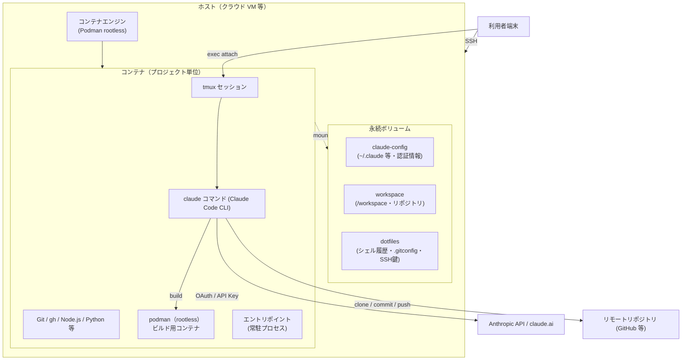
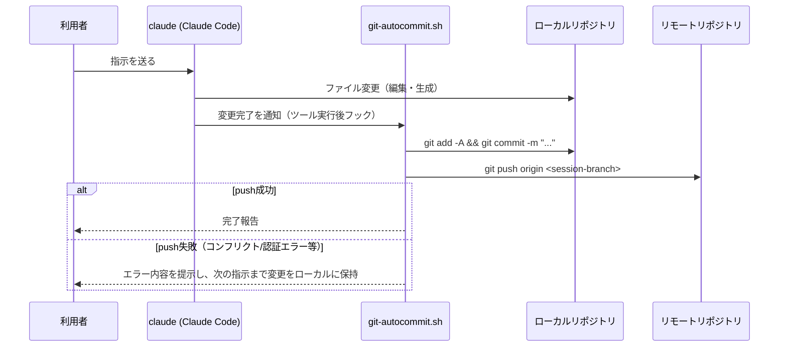

# claude-code-container 設計書

本書は [要件定義書](requirements.md) で定義した要件を実現するための技術設計をまとめたものである。
利用者向けの操作手順は [取り扱い説明書](manual.md)、利用シーンは [ユースケース定義書](use-cases.md)
を参照すること。各章末に対応する要件番号を付記する。

## 1. 全体アーキテクチャ


```mermaid
flowchart TB
    subgraph Host["ホスト（クラウド VM 等）"]
        Engine["コンテナエンジン\n(Podman rootless)"]
        subgraph Volumes["永続ボリューム"]
            V1["claude-config\n(~/.claude 等・認証情報)"]
            V2["workspace\n(/workspace・リポジトリ)"]
            V3["dotfiles\n(シェル履歴・.gitconfig・SSH鍵)"]
        end
        subgraph Container["コンテナ（プロジェクト単位）"]
            Tmux["tmux セッション"]
            CLI["claude コマンド (Claude Code CLI)"]
            Tools["Git / gh / Node.js / Python 等"]
            Nested["podman（rootless）\nビルド用コンテナ"]
            Entrypoint["エントリポイント\n(常駐プロセス)"]
        end
        Engine --> Container
        Container -. mount .-> Volumes
    end

    User["利用者端末"] -- SSH --> Host
    User -- "exec attach" --> Tmux
    Tmux --> CLI
    CLI -- "build" --> Nested
    CLI -- "OAuth / API Key" --> Anthropic["Anthropic API / claude.ai"]
    CLI -- "clone / commit / push" --> Remote["リモートリポジトリ (GitHub 等)"]
```

- 1コンテナ＝1プロジェクトを原則とし、同一ホスト上で複数コンテナを並行稼働できる（3.1, 4.4）。
- コンテナはフォアグラウンドプロセス（エントリポイント）により常駐し、`restart: unless-stopped`
  相当のポリシーで再起動に耐える（4.4, 5.2）。
- 認証情報・作業データはホスト側ボリュームに永続化し、コンテナのライフサイクルから切り離す（4.5）。

対応要件: 3.1, 4.3, 4.4, 4.7, 4.11

## 2. ディレクトリ構成

```
claude-code-container/
├── Dockerfile                  # Claude Code CLI + 開発ツールを含むイメージ定義
├── compose.yml                 # 常駐起動・ボリュームマウント定義（Podman 専用）
├── .env.example                # 対象リポジトリ・認証等の環境変数サンプル
├── scripts/
│   ├── check-env.sh            # セットアップ前環境チェック
│   ├── up.sh                    # 起動スクリプト（podman compose / podman-compose を自動選択）
│   ├── rebuild.sh               # コンテナ破棄→イメージのキャッシュ無し再ビルド→up.sh で再起動（ボリュームは保持）
│   ├── entrypoint.sh            # コンテナ常駐用エントリポイント（初回clone・権限調整）
│   ├── session-branch.sh        # 対話セッション開始検知→ブランチ作成
│   ├── git-autocommit.sh        # 変更検知→commit/push 自動化
│   └── lib/
│       └── compose-cmd.sh      # podman compose / podman-compose の検出（up.sh/rebuild.sh/attach.sh が共有）
├── docs/
│   ├── requirements.md
│   ├── use-cases.md
│   ├── design.md               # 本書
│   └── manual.md
└── README.md
```

対応要件: 6章（構成イメージ）

## 3. コンテナイメージ設計（Dockerfile）

| 項目 | 内容 |
| --- | --- |
| ベースイメージ | `debian:bookworm-slim` または `ubuntu:22.04` などの LTS 系 |
| ランタイム | Node.js 18 系（LTS）を `nodesource` 等から導入し、Claude Code CLI の動作要件を満たす |
| Claude Code CLI | `npm install -g @anthropic-ai/claude-code` 相当。`ARG CLAUDE_CODE_VERSION` でビルド時に固定バージョン／最新版を選択可能にする。自動アップデートを可能にするため、`NPM_CONFIG_PREFIX=/home/dev/.npm-global` として `dev` ユーザー権限（sudo 無し）でインストールする |
| 同梱ツール | `git`, `gh`（GitHub CLI）, `python3`/`pip`, `tmux`, `curl`, `ca-certificates` |
| 入れ子のコンテナ | `podman`（rootless）, `uidmap`, `fuse-overlayfs`, `slirp4netns`, `crun`。コンテナ内でビルド用コンテナを動かすために使う（3.2 参照） |
| 実行ユーザー | 非rootの一般ユーザー（例: `dev`, UID/GID をホストと合わせられるよう `ARG` で調整可） |
| 作業ディレクトリ | `/workspace` |
| ENTRYPOINT | `scripts/entrypoint.sh`（コンテナに `COPY` して実行権限を付与） |

対応要件: 4.1, 4.2, 4.6, 5.1

### 3.1 ビルド時パラメータ（ARG / 環境変数）

| 変数 | 用途 | 既定値 |
| --- | --- | --- |
| `CLAUDE_CODE_VERSION` | インストールする CLI バージョン | `latest` |
| `CONTAINER_UID` / `CONTAINER_GID` | 非root実行ユーザーの UID/GID（ホストとのファイル所有者整合） | `1000` |
| `ANTHROPIC_API_KEY` | API キー認証を使う場合に設定（未設定時は OAuth ログインを想定） | 未設定 |

### 3.2 コンテナ内 podman（rootless）の設定

コンテナ内の `dev` ユーザーが rootless podman でビルド用コンテナを動かせるよう、以下を設定する。

| 項目 | 内容 | 理由 |
| --- | --- | --- |
| `/etc/subuid`・`/etc/subgid` | `dev:1:<UID-1>` と `dev:<UID+1>:<65535-UID>`（既定 UID 1000 なら `dev:1:999` と `dev:1001:64535`） | 外側のコンテナ（ホストの rootless podman）で使える uid は 0〜65535 のみのため、その範囲内で dev 自身の uid を除いて割り当てる。入れ子のコンテナ内では 0〜65534（nobody まで）が使える |
| `storage.conf` | `driver = "overlay"`、`mount_program = "/usr/bin/fuse-overlayfs"` | コンテナ内ではカーネルの overlay を rootless で使えないため fuse-overlayfs を使う |
| `containers.conf` | `cgroup_manager = "cgroupfs"`、`events_logger = "file"` | コンテナ内には systemd / journald が無いため |
| `containers.conf` | `default_sysctls = []` | 入れ子では sysctl の設定が許されないための回避策。なお、入れ子のコンテナで proc をマウントできない場合の回避策として `volumes = ["/proc:/proc"]` があるが、入れ子のコンテナから外側コンテナのプロセス（環境変数や認証情報）が見えてしまうため使わない |

pull したイメージ等は `podman-storage` ボリューム（8章）に置く。

## 4. compose 設計（compose.yml）

```yaml
services:
  claude-code:
    build:
      context: .
      args:
        CONTAINER_UID: ${CONTAINER_UID:-1000}
        CONTAINER_GID: ${CONTAINER_GID:-1000}
    restart: unless-stopped
    tty: true
    stdin_open: true
    environment:
      - ANTHROPIC_API_KEY=${ANTHROPIC_API_KEY:-}
      - GIT_REPO_URL=${GIT_REPO_URL}
      - GIT_BASE_BRANCH=${GIT_BASE_BRANCH:-main}
      - CLAUDE_AUTO_APPROVE=${CLAUDE_AUTO_APPROVE:-true}
    devices:
      - /dev/fuse
      - /dev/net/tun
    security_opt:
      - label=type:container_engine_t
    volumes:
      - claude-config:/home/dev/.claude:Z
      - workspace:/workspace:Z
      - dotfiles:/home/dev/.dotfiles:Z
      - podman-storage:/home/dev/.local/share/containers:Z

volumes:
  claude-config:
  workspace:
  dotfiles:
  podman-storage:
```

- コンテナエンジンは Podman（rootless）専用とする。ボリュームには SELinux ラベル `:Z` を付ける。
- `devices: /dev/fuse`・`/dev/net/tun` と `security_opt: label=type:container_engine_t` は、コンテナ内で
  rootless podman（3.2 節）を動かすために必要。fuse-overlayfs が `/dev/fuse` を、入れ子のコンテナの
  ネットワーク（slirp4netns）が `/dev/net/tun` を使い、SELinux の
  既定の型（`container_t`）では入れ子の podman のマウント（fuse・proc・sysfs 等）が拒否されるため。
  `container_engine_t` は container-selinux が「コンテナ内でコンテナエンジンを動かす」用に用意している
  型で、マウントは許しつつ SELinux による閉じ込め（MCS による他コンテナとの分離など）は残る。
- ホストの SELinux ポリシーに `container_engine_t` が無い場合（`seinfo -t container_engine_t` で確認）は
  `label=disable` に置き換える。この場合は SELinux による閉じ込めが外れ、コンテナから抜け出された
  ときの歯止めが無くなる。
- プロジェクトを複数並行稼働させる場合は `-p <project-name>` を指定し、ボリューム名の衝突を防ぐ
  （5章参照）。`scripts/up.sh` は第一引数にプロジェクト名を受け取り、`-p` へ渡す。

対応要件: 4.4, 4.5, 4.8

## 5. 起動スクリプト設計（scripts/up.sh）

podman の compose コマンドでコンテナを起動するスクリプト。利用者は本スクリプト経由での起動を
基本とする（取り扱い説明書 3.4・6章も本スクリプト呼び出しに統一する）。

### 5.1 処理内容

```
1. .env を読み込む。
2. scripts/lib/compose-cmd.sh で compose コマンドを決める
   （podman compose が使えればそれを、無ければ podman-compose）。
3. 次のように起動する:
     podman compose（または podman-compose）-f compose.yml [-p <project>] up -d --build --force-recreate
4. podman compose / podman-compose が見つからない場合は、check-env.sh を未実施であることを
   案内して終了する。
5. 第一引数が与えられた場合、プロジェクト名として `-p` に渡す（5章の複数プロジェクト運用に対応）。
```

- 事前に `scripts/check-env.sh` を呼び出し、必須項目が NG の場合は起動処理へ進まない
  （4.9 のセットアップフロー統合要件に対応）。

対応要件: 4.8, 4.9

## 6. 環境チェック設計（scripts/check-env.sh）

### 6.1 チェック項目と判定ロジック

| # | 項目 | 区分 | 判定方法 | NG時の出力例・挙動 |
| --- | --- | --- | --- | --- |
| 1 | Podman の有無・バージョン | 必須 | `podman --version` の実行可否とバージョン比較（4.0 以上） | インストール手順 URL を提示し中断 |
| 2 | compose ツールの有無 | 必須 | `podman compose version` / `podman-compose --version` の実行可否 | 導入コマンド例を提示し中断 |
| 3 | `/dev/fuse`・`/dev/net/tun` | 必須 | それぞれがキャラクタデバイスとして存在するか | `modprobe fuse` / `modprobe tun` を案内し中断（コンテナ内 podman に必要） |
| 4 | 必須コマンド | 必須 | `command -v git` 等の存在確認 | パッケージマネージャ別インストールコマンドを提示し中断 |
| 5 | ディスク空き容量 | 必須 | `df` で作業ディレクトリのマウント先空き容量を取得し閾値と比較 | 必要空き容量と現状値を提示し中断 |
| 6 | git ユーザー情報（user.name / user.email） | 任意（警告） | `git config --get user.name` / `user.email` の設定有無を確認 | 未設定の場合、設定コマンド例を提示して警告表示するが、セットアップは続行可能 |
| 7 | メモリ | 任意（警告） | `/proc/meminfo` 等から総メモリ量を取得し閾値と比較 | 推奨メモリ量と現状値を警告表示するが、セットアップは続行可能 |
| 8 | ネットワーク到達性 | 必須 | `curl -sSf https://api.anthropic.com` 等への到達確認 | プロキシ設定・ファイアウォール確認を促し中断 |

- 「必須」項目が1つでも NG の場合はセットアップを中断する（4.9 の「必須項目にNGがある場合は
  中断」に対応）。「任意（警告）」項目は NG でも処理を継続するが、警告として結果に残す。
- メモリ・git ユーザー情報を「任意」とするのは、必要メモリ量がホスト構成やプロジェクト規模に
  依存し一律の閾値で中断させるのが適切でないこと、また git ユーザー情報はコンテナ内で後から
  設定してもコミット自体は行えるため、起動そのものを妨げるほどの必須項目ではないためである。
  将来的に必須へ変更する場合は本表を更新する。

### 6.2 出力フォーマット

```
[OK] Podman: 4.9.4 (>= 4.0 required)
[OK] podman-compose: podman-compose version 1.0.6
[OK] /dev/fuse: 利用可能
[OK] /dev/net/tun: 利用可能
[OK] git: 2.39.2
[NG] disk free space: 3.2GB (>= 10GB required)
      -> 対処: 不要なイメージ・ボリュームを削除するか、ディスクを拡張してください。
セットアップを中断しました。上記 NG 項目を解消後、再実行してください。
```

- 終了コード: 全項目 OK の場合 `0`、いずれかが必須項目で NG の場合 `1`（呼び出し元の
  セットアップスクリプトはこれを見て処理を中断する）。
- セットアップスクリプト（`scripts/up.sh`）から
  事前呼び出しされる想定とし、単体実行も可能にする。

対応要件: 4.9

## 7. エントリポイント設計（scripts/entrypoint.sh）

コンテナ起動時（初回のみ実行される処理と、毎回実行される処理を分離する）。

```
1. 毎回: ボリュームの所有者・パーミッションを非rootユーザーに合わせて調整（chown/chmod）。
   ただし podman-storage ボリュームは中身に subuid の uid が持ち主のファイルを含むため、
   最上位ディレクトリだけを chown する（-R で chown すると入れ子の podman のストレージが壊れる）
2. 毎回: dotfiles ボリューム（/home/dev/.dotfiles）配下の bash_history / gitconfig / ssh が
   未リンクであれば、~/.bash_history・~/.gitconfig・~/.ssh へのシンボリックリンクを作成する
   （既にリンク済みの場合はスキップし、8章のボリューム設計を実体化する）
3. 初回のみ判定: /workspace 配下にリポジトリが未 clone であれば
   git clone "$GIT_REPO_URL" /workspace/<repo>
   （2回目以降の起動では clone をスキップし、既存の作業内容をそのまま利用する）
4. tmux サーバーをバックグラウンドで起動（セッションが無ければ作成）
5. フォアグラウンドプロセスとして待受状態を維持（例: `tail -f /dev/null` あるいは
   `tmux -CC` の待受）し、コンテナを常駐させる
```

- 「対象リポジトリを一度だけ clone し、以降は切り替えない」という要件（4.11）を、
  `/workspace/.repo-initialized` のようなマーカーファイルの有無で判定する。
- 認証情報ディレクトリが空（初回起動）の場合は、`claude login` の実行を促すメッセージを
  標準出力に表示する。

対応要件: 4.3, 4.4, 4.11

## 8. データ永続化設計（ボリューム一覧）

| ボリューム | マウント先（コンテナ内） | 内容 | 消失時の影響 |
| --- | --- | --- | --- |
| `claude-config` | `/home/dev/.claude` | OAuth トークン、CLI 設定 | 再ログインが必要になる |
| `workspace` | `/workspace` | clone 済みリポジトリ、作業ファイル | 未pushの変更が失われる |
| `dotfiles` | `/home/dev/.dotfiles`（`~/.bash_history`, `~/.gitconfig`, `~/.ssh` をシンボリックリンク） | シェル履歴、Git設定、SSH鍵 | 認証設定・履歴が失われる |
| `podman-storage` | `/home/dev/.local/share/containers` | コンテナ内 podman が pull したイメージ・作ったコンテナ | イメージの再 pull が必要になる |

- ボリューム名はプロジェクト（compose の `-p` オプション）ごとに分離され、他プロジェクトと
  干渉しない（4.4, 4.5）。
- 認証情報・SSH鍵を含むボリュームはホスト側でパーミッション 600 相当に設定する運用を前提とする
  （5.1）。

対応要件: 4.5, 5.1

## 9. コンテナエンジン（Podman rootless 専用）

コンテナエンジンは Podman（rootless）専用とし、Docker には対応しない。

| 項目 | 内容 |
| --- | --- |
| ボリュームの SELinux ラベル | `compose.yml` のボリュームに `:Z`（専有）を付ける |
| compose 実行コマンド | `podman compose` または `podman-compose`。`scripts/lib/compose-cmd.sh` が存在確認をして自動選択し、`scripts/up.sh`・`scripts/rebuild.sh`・`scripts/attach.sh` が共有する |
| デーモンの有無 | デーモンレス・rootless。`sudo` 不要な手順のみを案内する |
| ネットワークモード | slirp4netns 等。明示的なポート公開が必要な場合のみ compose 側で調整 |
| コンテナ内 podman | `/dev/fuse`・`/dev/net/tun` の受け渡しと `label=type:container_engine_t` が必要（4章・3.2 節） |

対応要件: 4.8, 5.1, 5.4

## 10. 自動承認モード設計

- `claude` コマンドの起動時オプション（`--dangerously-skip-permissions` 相当）をデフォルトの
  起動コマンドに含める形で提供する（`.env` の `CLAUDE_AUTO_APPROVE=true` 等で on/off 切り替え）。
- 逐一確認したい利用者向けに、オプションを外した対話モードでの起動コマンドも README・
  取り扱い説明書に明記する。
- 破壊的操作（force push 等）は自動承認の対象から除外し、明示的な指示・確認を要する運用とする
  （実装上は Claude Code 自体の安全策に委ねる）。

対応要件: 4.10, 5.1

## 11. Git ワークフロー自動化設計

### 11.1 セッション開始の検知

対話セッション（Claude Code との1回の会話単位）の開始を検知する方式として、以下を採用する。

- Claude Code CLI が提供するセッション開始フック／イベント（利用可能な場合）を優先して使用する。
- CLI 側にフックがない場合のフォールバックとして、`scripts/session-branch.sh` を
  `claude` の起動ラッパーとして経由させ、ラッパー起動のたびに「新規対話セッション開始」と
  みなす。

### 11.2 ブランチ命名規則

```
session/<YYYYMMDD-HHMMSS>-<セッションID or ランダム短縮ID>
```

- ベースブランチ（既定 `main`、`.env` の `GIT_BASE_BRANCH` で変更可）から作成する。
- 利用者が明示的にブランチ名を指定したい場合は、起動時引数で上書きできるようにする。

### 11.3 commit / push 自動化


```mermaid
sequenceDiagram
    participant U as 利用者
    participant CLI as claude (Claude Code)
    participant Hook as git-autocommit.sh
    participant Repo as ローカルリポジトリ
    participant Remote as リモートリポジトリ

    U->>CLI: 指示を送る
    CLI->>Repo: ファイル変更（編集・生成）
    CLI->>Hook: 変更完了を通知（ツール実行後フック）
    Hook->>Repo: git add -A && git commit -m "..."
    Hook->>Remote: git push origin <session-branch>
    alt push成功
        Hook-->>U: 完了報告
    else push失敗（コンフリクト/認証エラー等）
        Hook-->>U: エラー内容を提示し、次の指示まで変更をローカルに保持
    end
```

- commit 粒度は「1指示（1ラウンドのやり取り）につき1コミット」を既定とする（要件定義書
  8章の未決事項に対する設計判断）。将来的に変更単位のスカッシュ等を選択できるよう、
  コミットメッセージにセッションID・指示要約を含める。
- push 失敗時（コンフリクト・認証エラー・ネットワーク断）は自動リトライを行わず、
  エラー内容を利用者に提示したうえで、次の指示が来るまでローカルコミットとして保持する
  （自動での force push は行わない）。
- Pull Request の自動作成は本フェーズのスコープ外とし、push までを自動化範囲とする
  （要件定義書 8章の未決事項に対する設計判断。将来的に `gh pr create` 連携を追加できる
  構成にしておく）。

対応要件: 4.11, 5.1

## 12. セキュリティ設計

- コンテナ内プロセスは非rootユーザー（`dev` 等）で実行し、`sudo` は付与しないか、
  パッケージ追加等に必要な最小限のコマンドのみに制限する。
- 認証情報を含むボリューム（`claude-config`, `dotfiles` 内のSSH鍵）は、ホスト側で
  パーミッション 600 / ディレクトリ 700 を徹底する。運用手順は取り扱い説明書に明記する。
- 自動承認モードは非root実行・作業ブランチの分離（11章）と組み合わせて運用し、
  破壊的操作（force push、`main` への直接push等）はデフォルトで無効化する。
- 個人利用を主目的とするため、コマンド実行やネットワークアクセスへの厳格なサンドボックス化は
  必須としない（要件定義書 5.1 に準拠）。

対応要件: 5.1

## 13. ログ・運用設計

- コンテナの標準出力ログは `podman-compose -f compose.yml logs -f` で確認できる
  構成とする。
- エントリポイント・自動commit/pushスクリプトは、処理内容（clone実行有無、commit hash、
  push成否）を標準出力へ出力し、ログとして残す。
- ホスト・コンテナの再起動後は `scripts/up.sh`（5章）を再実行するのみで復旧できる
  （8章のボリューム設計により状態が保持されるため、追加の復旧手順を要しない）。

対応要件: 5.2, 5.3

## 14. 要件定義書「今後の検討事項」への対応方針（本設計での暫定決定）

| 検討事項 | 本設計での方針 |
| --- | --- |
| commit粒度 | 1指示（1ラウンド）につき1コミットを既定とする（11.3） |
| PR作成の自動化範囲 | push までを自動化範囲とし、PR作成は対象外（将来拡張として `gh pr create` 連携を想定した構成にする） |
| 自動承認モードの操作範囲制限 | force push 等の破壊的操作をデフォルトで除外。明示的なブロックリストは本フェーズでは設けない |
| セッション開始・終了の検知方式 | CLI提供のフックを優先、無い場合は起動ラッパー（`session-branch.sh`）で代替（11.1） |

上記以外の未決事項（SSHアクセス時の鍵配布方式、複数プロジェクトの命名規則の標準化、
CI/CD連携要否、リソース上限設定要否）は、実装着手前に別途決定するか、初期リリースでは対象外として扱う。

対応要件: 8章
